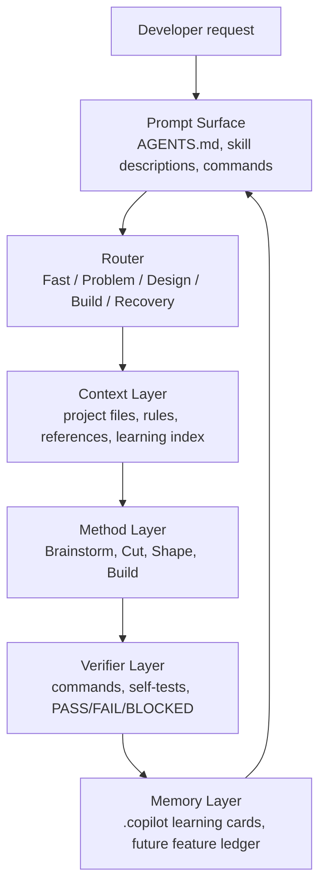

# DevFlow-Core PRD

Status: draft for iteration
Date: 2026-06-24
Owner: DevFlow-Core maintainers

This is a product and iteration document. It is allowed to live under `docs/` because it describes product direction, requirements, roadmap, and release gates. Runtime method source remains in `skills/*/references/*`.

## 1. Product Intent

DevFlow-Core should become a practical agent-engineering framework that developers can install, understand, and use in real work within minutes.

The product is not a theory collection and not a set of links to Ponytail, Agent Skills, Superpowers, PUA-Driven Spec Engineering, or PUA. The useful ideas from those projects must be converted into native DevFlow-Core behavior, files, skills, commands, tests, and release gates.

One sentence:

```text
DevFlow-Core helps coding agents turn problems and requirements into small verified changes through Sense, Brainstorm, Cut, Shape, Build, Prove, and Learn.
```

## 2. Target Users

| User | Job To Be Done | Pain Today | DevFlow-Core Promise |
|---|---|---|---|
| Solo developer using Codex/Claude/Copilot | Make agents follow a sane engineering flow | Agents overbuild, skip facts, and report done without proof | A lightweight default flow with proof before done |
| Team lead setting agent rules | Standardize how agents handle requirements, bugs, reviews, and learning | Every agent/harness behaves differently | Cross-platform entry files with one core contract |
| Framework/skill author | Improve agent behavior over time | Skills exist but do not trigger or validate | Skill anatomy, trigger surfaces, self-tests, and validation |
| Power user running long tasks | Recover from failures and prevent repeated mistakes | Agents retry the same path or forget corrections | Recovery route and learning-card loop |

## 3. Product Principles

1. **Executable Over Inspirational**: every method must have trigger, action, stop/handoff, and proof.
2. **Light Default, Escalate When Needed**: small work should not be buried under full methodology.
3. **Cut Before Code**: prefer no change, reuse, stdlib, platform, existing dependency, one-line/config, then minimum new code.
4. **Proof Before Done**: no completion claim without real command or scenario evidence.
5. **Memory With Recall**: repeated corrections become indexed cards that can be recalled next time.
6. **Adapters Are Thin**: platform files adapt the core contract; they do not become separate rule systems.
7. **PRD Is Not Runtime Source**: runtime rules stay in skills and references; PRD guides product iteration.

## 4. Architecture Model

The referenced image frames agent engineering as layers. DevFlow-Core adopts that as the product architecture:

```text
Prompt engineering        prompt and trigger surface
Loop engineering          retry, recovery, convergence
Harness engineering       commands, validation, verifier boundaries
Context engineering       what the agent reads, when, and why
Memory engineering        learning cards and future feature ledgers
Eval / Verifier engineering  self-tests, public proof, external status owner
Orchestration engineering skill chain, commands, optional subagents
```

### Agent Engineering Architecture



## 5. Reference Project Absorption

| Source | Product Lesson | Native DevFlow-Core Requirement |
|---|---|---|
| Ponytail | Minimal code wins only after understanding the flow | `devflow-cut` must block overbuild and require Reuse/Native/Scope/Diff checks |
| Agent Skills | Skills need anatomy, triggers, anti-rationalization, verification | Every `SKILL.md` must be executable and validated by `npm test` |
| Superpowers | Brainstorm, spec, plan, execute, verify, and pressure-test skill behavior | `devflow-spec`, `docs/specs/`, plan `Source` / `Spec coverage`, and flow self-tests must cover real scenarios, not just file presence |
| PUA-Driven Spec Engineering | Project memory, gated routing, skill activation checks, completion proof, Codex compatibility | `devflow-core`, `devflow-prove`, `devflow-learn`, and platform entries must stay aligned |
| PUA | Pressure recovery separates user challenge, re-alignment, proof, and learning | `devflow-pua` must stop wrong-path edits, re-ask or infer the desired result, switch approach, then prove |

## 6. Current Product State

| Area | Current Evidence | Status |
|---|---|---|
| Runtime prompt | `AGENTS.md` is prompt-sized and has route/trigger rules | Present |
| Core skills | `skills/devflow-*` cover core, brainstorm, spec, cut, build, prove, pua, learn, and audit | Present |
| Commands | `/devflow`, `/devflow-spec`, `/devflow-plan`, `/devflow-review`, `/devflow-debt`, `/devflow-prove`, `/devflow-pua`, `/devflow-learn`, `/devflow-audit`; `/devflow-spec`, `/devflow-plan`, `/devflow-review`, `/devflow-debt`, and `/devflow-audit` have bundled checkers/scanners | Improved |
| Validation | `npm test` validates required files, skill anatomy, commands, learning cards, package scripts, and stale paths; `npm run verify:all` runs the full local matrix including installer safety, target runtime drift checks, user-level installer checks, manifest coverage, installed runtime self-containment, debt scanner self-test, review gate self-test, spec checker self-test, plan-pack self-test, and audit scanner self-test | Improved |
| Trigger tests | `npm run trigger:verify` maps sample inputs to route, skill-path, and direct command trigger evidence | Improved |
| Host adapter smoke tests | `npm run host:verify` checks Codex/shared, Claude, Copilot, VS Code, CodeBuddy, plugin, and Gemini entry consistency | Present |
| Learning loop | `.copilot/LEARNING_INDEX.md`, `/devflow-learn`, and `npm run learn:verify` verify repeatable-pitfall recall | Present with executable check |
| Product PRD | This document defines product direction and architecture | Present after this change |
| Feature iteration ledger | `docs/features/devflow-core.md` and `docs/features/validation-harness.md` track long-lived capability history | Expanded |
| Harness/eval scoreboard | `npm run scenario:coverage` reports self-test coverage, weak layers, and suggested next scenarios; benchmark and adoption metrics remain future work | Improved |
| Onboarding polish | README includes install commands and 4 copyable workflows for problem investigation, requirement implementation, bug fixes, and target install verification | Improved |

## 7. Core Product Requirements

### R1. Prompt Surface

Agents must see enough from `AGENTS.md`, skill descriptions, and command descriptions to route correctly even when skill bodies are not loaded.

Acceptance:

- `AGENTS.md` stays prompt-sized.
- It includes Problem, Fast, Design, Build, Recovery routes.
- It includes ASCII trigger words for problem reports, requirements, bug reports, completion claims, and learning signals.
- Validation blocks README-style sections inside `AGENTS.md`.
- `npm run trigger:verify` checks sample prompt-to-route evidence and direct command trigger coverage.

### R2. Lifecycle Router

The router must classify incoming work into the lightest safe route.

Acceptance:

- Problem reports prove facts before edits.
- Requirements run Brainstorm and Cut before Build.
- Bug fixes run Root-Cause Check before edits.
- Repeated failure, user challenge, changed-wrong result, or user correction enters Recovery; pressure cases load `devflow-pua` and Learn when reusable.

### R3. Brainstorm And Shape

The framework must make ambiguous work concrete without forcing full ceremony on small tasks.

Acceptance:

- Brainstorm outputs goal, constraints, success criteria, assumptions, 2-3 approaches, and recommendation.
- Larger or explicitly spec-requested work writes a saved spec under `docs/specs/<short-kebab-name>.md`.
- Shape outputs smallest useful plan, not doing, impact, and verification.
- For implementation requests, Shape must continue into Build and Prove.

### R4. Cut / Anti-Overengineering

Before adding code or structure, the framework must search for smaller options.

Acceptance:

- Reuse Check confirms existing helpers/patterns were searched.
- Native Check considers standard library and platform capability.
- Overbuild Check blocks unneeded dependency, abstraction, config, directory, framework layer, or generic engine.
- Diff Check maps each changed file to the user goal.

### R5. Build Slices

Implementation should happen in reviewable slices.

Acceptance:

- Multi-step work defines file-scoped slices.
- Each slice has acceptance and verification.
- Saved implementation plans land in `docs/plans/<short-kebab-name>.md` by default and include `Source:` plus `Spec coverage:`.
- `docs/features/` remains for feature ledgers, not generated specs or implementation plans.
- Unrelated cleanup is blocked unless required by the current goal.

### R6. Proof Gate

The framework must not let agents self-certify success.

Acceptance:

- Completion output contains command, result, and PASS/FAIL/BLOCKED.
- Verification is fresh and scoped to the claim.
- Rule, command, prompt, entry, and skill changes include a Skill Activation Check before completion.
- If external verifier/human owns final approval, agent reports candidate status only.

### R7. Learning Loop

User corrections and repeated pitfalls must become indexed, recallable next-time rules.

Acceptance:

- `.copilot/LEARNING_INDEX.md` links all active learning cards.
- Every card has Trigger, Lesson, Next action, Scope, and Related.
- Repeated correction and misplaced content trigger `devflow-learn`.
- Validation checks card links and fields.
- `npm run learn:verify` validates the repeated-correction Learning closure path.

### R8. Product Iteration Ledger

The project needs a long-lived way to track feature evolution over time.

Implemented path:

```text
docs/features/{feature-name}.md
```

Acceptance:

- Create a feature ledger artifact for each major product capability.
- Track current version, status, capability scope, non-goals, history, decisions, constraints, and related changes.
- Before changing an existing feature, read its ledger.
- After a feature change, write back version/history/decision updates.

This remains a product/project artifact, not runtime method source.

### R9. Harness And Eval System

The product needs visible confidence, not just instructions.

Acceptance for future implementation:

- Expand `flow-self-test.md` into scenario groups for prompt, loop, context, memory, verifier, and orchestration layers.
- Add a command or script that reports scenario coverage. Implemented first pass: `npm run scenario:coverage`, including weak-layer hints.
- Add a benchmark/adoption scoreboard only after metrics are reproducible.

### R10. Developer Onboarding

Developers should know how to install, invoke, verify, and iterate.

Acceptance:

- README links to this PRD as product direction.
- README keeps quick-start commands.
- `npm run install:target -- <path>` performs a safe dry-run install; `--write` copies missing runtime files; `--force` is required to overwrite existing files; `--check` verifies target runtime files still match the package.
- `npm run install:verify` validates installer dry-run, write-skip, target runtime check, force-overwrite, manifest coverage, and installed runtime self-containment.
- `npm run install:user -- [--write] [--force] [--check]` installs user-level `skills/`, `commands/`, and `scripts/devflow-*.js` into `CODEX_HOME` or `~/.codex`; `npm run user:verify` validates that behavior.
- README contains 4 copyable workflows, including target install verification.
- Each supported host has a thin entry point.
- `npm run host:verify` checks supported host entry consistency.
- `npm run verify:all` is the canonical full local validation matrix.
- `npm run debt:verify` validates the bundled `devflow:` marker scanner.
- `npm run review:verify` validates the bundled review gate scanner.
- `npm run spec:verify` validates the bundled spec checker.
- `npm run plan:verify` validates the bundled plan-pack checker.
- `npm run audit:verify` validates the bundled repo-wide audit scanner.
- `npm test` remains the package validation entry.

## 8. Roadmap

### P0: Usable Core Pack

Goal: Developers can install and use the workflow today.

Scope:

- Prompt-sized `AGENTS.md`
- 9 core skills
- Commands for route, spec, plan, review, debt, prove, pua, audit
- Dry-run-first target project installer
- Dry-run-first user-level installer for Codex skills, commands, and scripts
- Executable debt marker scanner for `/devflow-debt`
- Executable gate scanner for `/devflow-review`
- Executable spec checker for `/devflow-spec`
- Executable plan-pack checker for `/devflow-plan`
- Executable repo-wide audit scanner for `/devflow-audit`
- Pressure recovery skill and command for `/devflow-pua`
- Learning-card loop
- `npm test` validation
- PRD and architecture model

Exit criteria:

- `npm test` passes.
- README and PRD explain what to use and why.
- Installer dry-run, write-skip, target runtime check, force-overwrite, manifest coverage, and installed runtime self-containment are covered by `npm run install:verify`.
- Self-tests cover feature, problem, bug, correction, completion, and target install verification flows.

### P1: Iteration Memory

Goal: Make the framework improve across product iterations.

Scope:

- Feature iteration ledger seeded with `docs/features/devflow-core.md`
- Decision log for major product changes
- PRD-driven roadmap updates
- Stronger learning promotion rules from card to AGENTS/skill

Exit criteria:

- Existing feature changes begin by reading the feature ledger.
- Completed changes write back history and constraints.

### P2: Harness Confidence

Goal: Make quality visible and repeatable.

Scope:

- Scenario coverage report
- Skill trigger tests
- Cross-host smoke tests. Implemented first pass: `npm run host:verify`.
- Optional benchmark scoreboard inspired by Ponytail, only with reproducible methodology

Exit criteria:

- A maintainer can run one command and see which product behaviors are covered.
- Benchmark claims include method, sample, limitations, and reproduction steps.

### P3: Orchestration Escalation

Goal: Support harder work without making small work heavy.

Scope:

- Optional subagent/reviewer patterns
- Policy/verifier split for high-risk changes
- External human/verifier status boundary

Exit criteria:

- Complex tasks can use orchestration.
- Default small tasks remain light.

## 9. Non-Goals

- Do not recreate all 24 Agent Skills.
- Do not make full OpenSpec mandatory for every change.
- Do not put runtime framework source under `docs/`.
- Do not add a dependency, hook system, database, or CI platform before a current need exists.
- Do not claim benchmark results until reproducible tests exist.
- Do not make AGENTS.md a README or method reference dump.

## 10. Release Gates

Before declaring DevFlow-Core ready for a release:

1. `npm run verify:all` passes.
2. README quick start still matches actual files.
3. `AGENTS.md` remains prompt-sized.
4. All skills have trigger-rich descriptions and proof/verification sections.
5. Flow self-tests cover the release's claimed behaviors.
6. Learning-card links and fields validate.
7. Any benchmark/adoption claim has reproducible evidence.

## 11. Success Metrics

| Metric | Target |
|---|---|
| Time to understand first use | Developer can explain route/skills/verify in under 10 minutes |
| Completion proof rate | 100% of completion claims include command/result/judgment |
| Overbuild prevention | New dependencies/abstractions require explicit why-now evidence |
| Learning recall | Repeated corrections produce or update a card before completion |
| Scenario coverage | Each architecture layer has at least one self-test scenario by P2 |
| Adoption readiness | README, PRD, commands, skills, and validation tell one coherent story |

## 12. Open Questions

1. When should DevFlow Core split into multiple ledgers instead of one runtime ledger?
2. Which learning signals should promote from card-only memory into AGENTS.md or skill rules?
3. Which hosts should get first-class smoke tests after Codex/Claude/Copilot/CodeBuddy entries?
4. What benchmark is fair enough to publish without creating misleading marketing claims?
5. Which orchestration layer is worth adding first: reviewer, verifier, or policy guardian?

## 13. Immediate Iteration Backlog

| Priority | Item | Why | Proof |
|---|---|---|---|
| P0 | Validate this PRD exists and is linked | Product direction should not be orphaned | `npm test` and README link |
| P1 | Expand feature iteration ledger coverage | Avoid losing feature history across changes | Additional ledgers for major capabilities |
| P1 | Expand Memory/Learning scenarios | Keep harness confidence actionable as learning behavior evolves | More learning-card lifecycle scenarios |
| P1 | Expand onboarding scenarios | Make the framework more attractive to developers | More copyable workflows, target install checks, and host-specific examples |
| P2 | Expand trigger tests for skills | Ensure more skills activate when intended | More test prompts mapped to skills |
| P2 | Add reproducible benchmark harness | Support claims like Ponytail without hand-waving | Benchmark command and report |

## 14. PRD Acceptance Criteria

This PRD is useful only if it changes how the project iterates.

Acceptance:

- It defines users, problems, principles, architecture, requirements, roadmap, non-goals, release gates, metrics, and immediate backlog.
- It references the image-derived agent engineering layers.
- It traces reference project ideas into native DevFlow-Core requirements.
- It does not move runtime method source into `docs/`.
- It is linked from README.
- It is included in validation.
