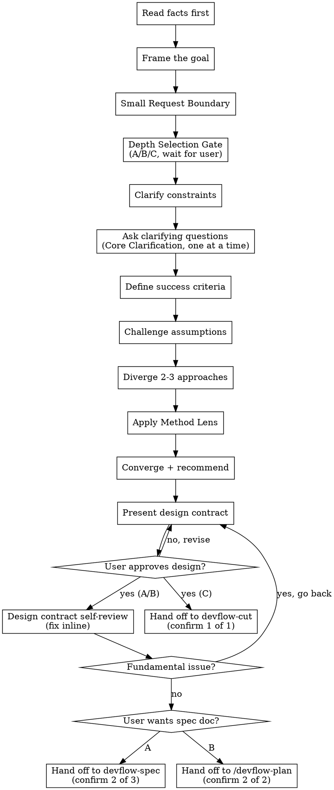

# DevFlow Brainstorm

Turn a request into the smallest useful design before implementation, through collaborative dialogue with the user.

**Violating the letter of the rules is violating the spirit of the rules.**

<HARD-GATE>
Do NOT hand off to `devflow-cut`, `devflow-build`, write any code, or take any implementation action until you have presented a design contract and the user has approved it. This applies to EVERY request regardless of perceived simplicity. The Depth Selection Gate (A/B/C) must be presented before clarification begins — the user chooses the depth, not the LLM.
</HARD-GATE>

## Anti-Pattern: "This Is Too Simple To Need A Design"

Every request goes through this process. A config change, a single-function fix, a one-liner — all of them. "Simple" requests are where unexamined assumptions cause the most wasted work. The design can be short (a few sentences for truly simple work), but you MUST present it and get approval. Design-lite shortens the design — it does not skip the dialogue.

## Process

1. **Read facts first**: inspect relevant files, docs, configs, tests, existing behavior, and patterns.
2. **Frame the goal** as a one-sentence problem statement.
3. **Check the Small Request Boundary**: decide whether this is Design-lite, full Design, or needs user route choice.
4. **STOP — Depth Selection Gate**: Present A/B/C depth options to the user (see Depth Selection Gate section). Wait for their choice. The selected depth determines how many confirmations follow and whether spec documents are landed.
5. **Clarify constraints**: compatibility, security, data, UX, performance, platform, time.
6. **STOP — Core Clarification** (required for all depths): Ask one question at a time. Wait for the user's response before continuing. Prefer multiple choice when possible. Only infer from project facts when the question is purely technical and evidence is unambiguous. If it is a business decision, ask. Even when depth C is selected and all boundary gates pass, you MUST still complete the 3 core questions before continuing.
7. **Define success criteria** the user or agent can verify.
8. **Challenge hidden assumptions**:
   - Does this need to exist?
   - What remains true from first principles (第一性原理) if the requested implementation, current abstraction, or preferred solution is removed?
   - Is the user asking for an implementation when a smaller outcome works?
   - What current system behavior may already satisfy the goal?
   - What would make this design unacceptable?
9. **Diverge** with 2-3 genuinely different approaches unless Design-lite applies (Step 3 gates passed) or depth C is selected with all boundary gates passing.
10. **Apply a Method Lens** when the design, risk, or ambiguity needs a specific working strategy.
11. **Converge** with a recommendation and a Not Doing list, incorporating the Method Lens if applied.
12. **STOP — Present design contract**: Present the design contract to the user. Ask whether it looks right. If the user requests changes, go back to the relevant step. Only proceed once the user approves.
    - **Depth A/B**: this is confirmation 1 of 3/2. Continue to step 13.
    - **Depth C**: this is confirmation 1 of 1. User approval here means the design is confirmed — proceed directly to `devflow-cut` (skip steps 13-14).
13. **Design contract self-review** (Depth A/B only): Before handing off, check the design contract for unresolved filler text, internal contradictions, scope creep, and ambiguity. Fix inline. If a fundamental issue is found (scope needs decomposition, approach contradicts goal), go back to the relevant step instead of patching inline.
14. **Depth-based handoff** (Depth A/B only):
    - **Depth A**: **STOP — Confirm spec** → hand off to `devflow-spec` to land `docs/specs/<name>.md` (confirmation 2 of 3). After spec, hand off to `/devflow-plan` (confirmation 3 of 3).
    - **Depth B**: **STOP — Confirm plan** → hand off to `/devflow-plan` to create a Plan Pack (confirmation 2 of 2).
    - Recommend one based on project size and cross-module impact, but let the user decide. Wait for their response.

## Process Flow



The terminal state depends on the depth selected at the Depth Selection Gate:
- **Depth A**: `devflow-spec` → `/devflow-plan` → `devflow-cut` → `devflow-build` → `devflow-prove`
- **Depth B**: `/devflow-plan` → `devflow-cut` → `devflow-build` → `devflow-prove`
- **Depth C**: `devflow-cut` → `devflow-build` → `devflow-prove`

Do NOT hand off to `devflow-build` or any other implementation skill directly.

## Core Questions

Ask the smallest missing question, one at a time:

```text
Goal: Who is this for, and what problem is solved?
Constraints: What cannot move?
Acceptance: What visible proof means this worked?
```

If one answer is missing but can be inferred from project facts, state the inference and evidence. If it is a business decision, **ask the user and wait** — do not infer.

## Interview Discipline

For any non-trivial Brainstorm pass:

1. Read `skills/devflow-brainstorm/references/interview-discipline.md`.
2. Use Brainstorm's one-question-at-a-time interview discipline.
3. Include a recommended answer with each question.
4. If code, docs, config, tests, or feature ledgers can answer the question, read those facts instead of asking.
5. When documentation capture is requested or needed, choose the right DevFlow docs surface: `devflow-spec` for saved requirements, feature ledger for capability history, ADR for hard-to-reverse trade-offs.
6. End with the normal DevFlow design contract and hand off to `devflow-cut`, `devflow-spec`, or the user.

This is core `devflow-brainstorm` behavior, not a separate workflow.

### Question Rules

- **One question per message.** If a topic needs more exploration, break it into multiple questions.
- **Prefer multiple choice** when possible — easier for the user to answer than open-ended.
- **Wait for the user's response** before continuing to the next step.
- **Only infer from facts** when the question is purely technical and evidence is unambiguous.
- **Never infer business decisions** — always ask the user.

## Re-Ask After Challenge

When `devflow-pua` hands off after user challenge, changed-wrong result, repeated missing-piece feedback, or repeated miss:

1. Restate the current understanding of the user's goal.
2. Treat the prior approach as failure evidence only; do not reuse the old plan, target, or proof claim unless the user or fresh facts explicitly confirm it.
3. Name what was likely misread: target, artifact, behavior, UI distinction, file placement, or proof.
4. Carry forward the compact methodology line `METHOD: {flavor} / {method}`, any `SWITCH:` line, `User-view miss`, `Satisfaction gap`, and `New success contract` from `devflow-pua`.
5. Ask where the result is wrong, what result is wanted, what must stay unchanged, and what proof would count as corrected when those answers cannot be inferred from facts.
6. If the user repeatedly says pieces are missing, build a Coverage Map of required surfaces before proposing changes.
7. If the prior guiding method failed, use the switched different/opposite method from `devflow-pua` and do not propose another variation of the old method.
8. Compare a corrected direct approach with at least one materially different approach or no-change/reuse option.

Question shapes:

```text
What exact result should the user see?
What is wrong with the current output?
What is missing or incomplete?
Which expected surface is missing: file, command, skill, docs, install sync, UI, backend behavior, or proof?
What must stay unchanged?
What proof would count as corrected?
```

Do not keep the previous plan unless facts prove it still matches the user's desired result. Do not treat repeated "missing this/missing that" or "少了这个/少个那个" as normal incremental scope until `devflow-pua` has classified whether it is a coverage gap or a new requirement.

## Small Request Boundary

Design-lite is allowed only when all four gates pass:

- Impact: one local behavior, file, setting, doc section, or display field.
- Risk: no auth, money, permissions, data migration, deletion, external API contract, release flow, or security boundary.
- Uncertainty: goal, expected behavior, and acceptance proof are already clear.
- Proof: a narrow command, search check, focused test, or manual scenario can verify it quickly.

**Design-lite shortens the design, not the dialogue.** Even when all gates pass, you MUST still confirm the goal and acceptance criteria with the user before producing the design contract. If the gates pass and only one implementation path is plausible, do not force 2-3 approaches. Output:

```text
Small Boundary: impact <small>; risk <small>; uncertainty <small>; proof <quick>
```

If the gates do not decide the route, ask the user to choose Fast, Design-lite, or full Design.

## Depth Selection Gate

[CRITICAL] **The LLM must not decide to skip any stage or document. Depth is chosen by the user, not asserted by the LLM.**

After checking the Small Request Boundary, present the depth options to the user and **wait for their choice before continuing**:

```text
📋 Enter design flow. Select design depth for this task:

A. Full Spec (recommended for cross-module / new feature / architecture change)
   → Feature Ledger → Design Contract → devflow-spec → /devflow-plan → devflow-cut → devflow-build
   → 3 confirmations: design contract, spec doc, plan

B. Simplified Spec (for clear-scope changes)
   → Feature Ledger → Design Contract → /devflow-plan → devflow-cut → devflow-build
   → 2 confirmations: design contract, plan

C. Dialogue Confirmation (only for single-file / low-risk / user-explicit)
   → Core Clarification 3 questions → dialogue confirm → devflow-cut → devflow-build
   → 1 confirmation: dialogue confirm
   → No spec document, but Core Clarification 3 questions are still required

Select A / B / C:
```

**Selection constraints** (based on Small Request Boundary gates):

| Boundary Result | Allowed Depths |
|----------------|----------------|
| All 4 gates pass (low impact, low risk, clear, quick proof) | A / B / C |
| 1-2 gates fail (moderate complexity or risk) | A / B |
| 3+ gates fail or new feature / architecture change | A only |
| New feature or architecture change | A only (C not allowed) |

**Additional constraints**:
- User selects C: AI must re-confirm once: "Confirm no spec document? Design decisions cannot be traced later."
- Design-lite gates all pass AND user selects C: allowed, but Core Clarification 3 questions are still mandatory

[CRITICAL] **Prohibited behaviors**:
- LLM self-decides "low risk, skip design"
- LLM says "nearly zero risk, start coding"
- LLM proceeds without presenting depth options
- LLM uses "simple / zero-risk / trivial" language to steer user toward C

### Depth Flow Table

| User Choice | Flow Path | Confirmations |
|----------|---------|---------|
| **A. Full Spec** | Feature Ledger → Design Contract → devflow-spec → /devflow-plan | 3 |
| **B. Simplified Spec** | Feature Ledger → Design Contract → /devflow-plan | 2 |
| **C. Dialogue Confirmation** | Core Clarification 3 questions → dialogue confirm → devflow-cut | 1 |

```text
Full path (select A):
Feature Ledger → Design Contract ─→ devflow-spec ─→ /devflow-plan
                  (confirm 1)        (confirm 2)      (confirm 3) → devflow-cut → devflow-build

Simplified path (select B):
Feature Ledger → Design Contract ─→ /devflow-plan
                  (confirm 1)        (confirm 2) → devflow-cut → devflow-build

Dialogue path (select C):
Core Clarification 3 questions → dialogue confirm
                                  (confirm 1) → devflow-cut → devflow-build
```

### Feature Ledger Check

Before producing the design contract, check for an existing feature ledger:

1. **Search**: look for `docs/features/*.md` matching the capability being changed.
2. **Read or note**: if found, read current state and constraints. If not found, note it as a new capability.
3. **Update after validation**: feature ledgers are updated after `devflow-prove` passes, not during brainstorm.

Output before the design contract:

```text
✅ Feature Ledger check:
- Feature ledger: [found: docs/features/{name}.md / new / not applicable]
- Capability: {feature-name}
- Key constraints: {constraints from existing ledger or "none"}
```

## Large Project Decomposition

If the request describes multiple independent subsystems (e.g., "build a platform with chat, file storage, billing, and analytics"), flag this immediately. Do not spend questions refining details of a project that needs to be decomposed first.

Help the user decompose into sub-projects: what are the independent pieces, how do they relate, what order should they be built? Then brainstorm the first sub-project through the normal design flow. Each sub-project gets its own design → cut → build cycle.

## Working in Existing Codebases

- Explore the current structure before proposing changes. Follow existing patterns.
- Where existing code has problems that affect the work (e.g., a file that's grown too large, unclear boundaries, tangled responsibilities), include targeted improvements as part of the design.
- Do not propose unrelated refactoring. Stay focused on what serves the current goal.

## Approach Comparison

Each option must include:

- what it does
- what it does not do
- tradeoff
- impact size
- verification

Use this shape:

```text
Approach comparison:
- A: does / does not do / tradeoff / verification
- B: does / does not do / tradeoff / verification
- C: does / does not do / tradeoff / verification (optional)
Recommendation: <one option>, because <reason>
```

## Method Lens

For Design work that would otherwise feel generic, choose one primary lens and at most one secondary lens:

- Root Cause: bug, regression, failing proof, repeated symptom.
- Working Backwards: product, UX, API, workflow, or ambiguous value.
- First Principles Cut (第一性原理): problem solving, bug fixes, scope, dependency, abstraction, or architecture pressure; reduce the request to facts, constraints, invariants, and the smallest necessary mechanism before proposing a solution.
- Data/Proof: metrics, validation, benchmark, release, or verifier-sensitive work.
- Operational Owner: cross-file, cross-agent, install, release, or handoff work.

Output:

```text
Method Lens: primary <lens>; secondary <lens/none>; why <risk or decision it handles>
```

Do not import PUA flavor, pressure rhetoric, or default full OpenSpec to use a lens.

## Required Design Contract

```text
Goal: what to solve
Smallest useful plan: why this is the smallest useful solution now
Not doing: what is explicitly cut
Impact: modules/files/behavior involved
Verification: command or scenario that proves it
```

## Design Contract Self-Review

Before handing off, review the design contract with fresh eyes:

1. **Completion-marker scan**: Any unresolved marker text, incomplete sections, or vague requirements? Fix them.
2. **Internal consistency**: Do any parts contradict each other? Does the approach match the stated goal?
3. **Scope check**: Is this focused enough for a single implementation, or does it need decomposition?
4. **Ambiguity check**: Could any requirement be interpreted two different ways? If so, pick one and make it explicit.

Fix any issues inline. No need to re-review — just fix and move on.

## Depth-Based Handoff

After the design contract is approved and self-reviewed, proceed based on the depth selected at the Depth Selection Gate. The depth was already chosen — do not re-ask.

### Depth A: Full Spec (3 confirmations)

Design contract approved (confirmation 1) → hand off to `devflow-spec`:

```text
Spec input: approved design + not-doing list + impact scope + acceptance/verification
Default landing: docs/specs/<short-kebab-name>.md
Next: devflow-spec (confirm 2) -> /devflow-plan (confirm 3) -> devflow-cut -> devflow-build
```

Recommend Depth A when:
- The user asks for specs, a design doc, or a requirements document.
- Requirements cross modules, APIs, persistence, release flow, or user-visible workflows.
- A future plan needs to map tasks back to stable requirements.

### Depth B: Simplified Spec (2 confirmations)

Design contract approved (confirmation 1) → hand off to `/devflow-plan`:

```text
Plan input: approved design + not-doing list + impact scope + verification method
Default landing: docs/plans/<short-kebab-name>.md
Next: /devflow-plan (confirm 2) -> devflow-cut -> devflow-build
```

Recommend Depth B when:
- Impact is local, risk is low, and a short design contract is enough.
- The user wants to move fast and the design contract captures all needed context.

### Depth C: Dialogue Confirmation (1 confirmation)

Design contract approved = confirmation 1 of 1. No spec document is landed. Hand off directly to `devflow-cut`:

```text
Cut input: approved design + not-doing list + impact scope + verification method
Next: devflow-cut -> devflow-build
```

**Depth C constraint**: The user must have explicitly chosen C at the Depth Selection Gate. The LLM must not auto-select C. Core Clarification 3 questions were still completed.

## Anti-Rationalization

| Excuse | Reality |
|---|---|
| "The user already gave a solution." | A proposed solution is not the goal. Check the goal. |
| "Only one approach is obvious." | Compare at least a direct option and a reuse/no-change option. |
| "Questions slow us down." | One precise question prevents the wrong build. |
| "We can decide scope during coding." | Scope belongs in the design contract before Build. |
| "This is too simple to need a design." | Simple requests are where assumptions hide. Present a short design and get approval. |
| "I can infer the goal from code." | If it involves a business decision, ask the user. Code tells you what exists, not what the user wants. |
| "This is low risk, skip the depth gate." | Depth is chosen by the user, not asserted by the LLM. Present A/B/C every time. |
| "Depth C means no design needed." | Depth C still requires Core Clarification 3 questions and a design contract. It only skips document landing. |

## Red Flags — STOP

- About to write code before presenting a design contract
- "This is too simple to need a design"
- "The user already described the solution, so I can skip dialogue"
- "I can infer the business decision from the codebase"
- Combining multiple clarifying questions into one message
- Proceeding past a STOP gate without user response
- Handing off directly to `devflow-build` instead of `devflow-spec`, `/devflow-plan`, or `devflow-cut`
- Proceeding without presenting the Depth Selection Gate (A/B/C)
- LLM self-deciding depth instead of letting the user choose

**All of these mean: stop and return to the design dialogue.**

## Quality Bar

- Keep the design short for low-risk work.
- Do not invent future features.
- **One question at a time.** Do not overwhelm with multiple questions in a single message.
- **Wait for user response** at every STOP point before continuing.
- After a user challenge, do not continue with the old approach unless the goal and desired result are now proven.
- Mark high-risk or irreversible decisions and require explicit approval.
- If the user asked to implement, continue based on selected depth: A → `devflow-spec` → `/devflow-plan`, B → `/devflow-plan`, C → `devflow-cut`.

## Handoff Gate

Do not hand off directly to Build. After the depth is selected and design contract is approved:

- **Depth A (Full Spec)**: hand off to `devflow-spec`, then `/devflow-plan`, then `devflow-cut`:

```text
Spec input: approved design + not-doing list + impact scope + acceptance/verification
Default landing: docs/specs/<short-kebab-name>.md
Next: devflow-spec (confirm 2) -> /devflow-plan (confirm 3) -> devflow-cut -> devflow-build
```

- **Depth B (Simplified Spec)**: hand off to `/devflow-plan` to create a Plan Pack, then `devflow-cut`:

```text
Plan input: approved design + not-doing list + impact scope + verification method
Default landing: docs/plans/<short-kebab-name>.md
Next: /devflow-plan (confirm 2) -> devflow-cut -> devflow-build
```

- **Depth C (Dialogue Confirmation)**: hand off directly to `devflow-cut`:

```text
Cut input: approved design + not-doing list + impact scope + verification method
Next: devflow-cut -> devflow-build
```

The design must be user-approved, and the depth must be user-selected at the Depth Selection Gate, before any handoff.

## Verification

Before leaving this skill, confirm:

- [ ] Facts were read or unknowns were named.
- [ ] Goal was framed before checking Small Request Boundary.
- [ ] Small Request Boundary was checked for tiny requirement or feature work.
- [ ] Depth Selection Gate was presented and user selected A, B, or C.
- [ ] Goal, constraints, and success criteria exist — confirmed with the user when unclear, not just inferred.
- [ ] Core Clarification 3 questions were completed (required for all depths, including C).
- [ ] Clarifying questions were asked one at a time and user responses were received.
- [ ] 2-3 approaches were compared when plausible, or Design-lite/Depth C was justified by the boundary gates.
- [ ] First principles (第一性原理) were applied when assumptions, abstractions, bug causes, or architecture choices could hide a smaller solution.
- [ ] Method Lens was selected or explicitly marked unnecessary, before convergence.
- [ ] Recommended option is the smallest useful path.
- [ ] Design contract was presented and user approved it.
- [ ] Design contract self-review was run (Depth A/B only): no unresolved filler text, contradictions, or ambiguity.
- [ ] Depth-based handoff was executed correctly:
  - A: devflow-spec → /devflow-plan (3 confirmations)
  - B: /devflow-plan (2 confirmations)
  - C: devflow-cut (1 confirmation)
- [ ] Design contract is complete.
