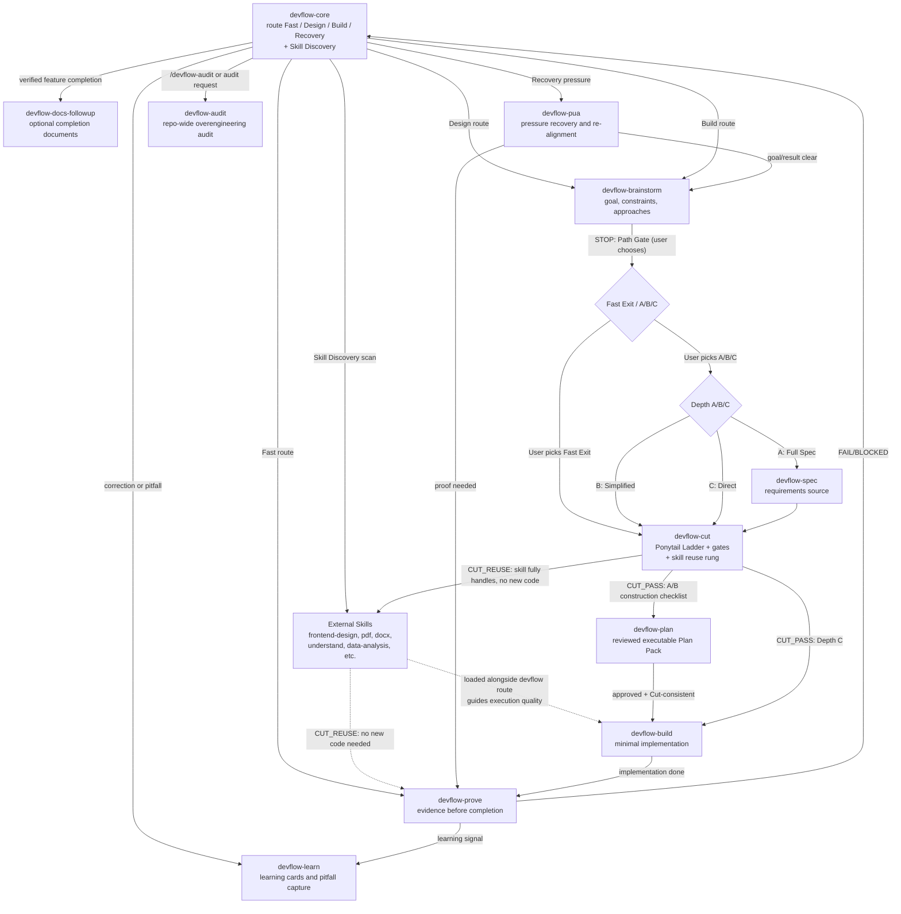

# DevFlow Core Skill Call Diagram



## Runtime Chain

```text
devflow-core -> [Skill Discovery: scan available environment skills]
  -> if external skill matches task: suggest loading it alongside the devflow route
  -> external skills guide execution quality; devflow manages scope and risk
  -> devflow chain (brainstorm -> cut -> build -> prove) always runs
  -> CUT_REUSE only when skill fully handles task with no new code needed
devflow-core -> devflow-brainstorm -> [STOP: Path Gate: user chooses Fast Exit or A/B/C]
  -> Fast Exit (user-chosen): short design contract -> devflow-cut -> devflow-build
  -> A/B/C (user-chosen): A: devflow-spec -> devflow-cut -> /devflow-plan | B: devflow-cut -> /devflow-plan | C: direct -> devflow-cut
-> devflow-cut [rung 4: does an available skill handle this without new code? -> CUT_REUSE if yes]
  -> CUT_PASS A/B: devflow-plan -> approved plan + Cut-consistency review -> devflow-build
  -> CUT_PASS C: devflow-build
devflow-core --> devflow-pua
devflow-pua --> devflow-brainstorm
devflow-pua --> devflow-prove
devflow-prove --> devflow-learn
devflow-core --> devflow-docs-followup (after verified feature completion)
devflow-core --> devflow-audit
devflow-core --> external skills (frontend-design, pdf, docx, understand, data-analysis, etc.) loaded alongside devflow route
```

## Short Rules

- Requirements and behavior changes enter `devflow-brainstorm`, which presents a Path Selection Gate: when Fast Exit conditions are met (small change to existing feature, all boundary gates pass, single plausible path), Fast Exit is offered as a recommended option alongside A/B/C. The user chooses the path — the LLM does not auto-select.
- Depth A saves a spec via `devflow-spec`, then runs `devflow-cut`, then writes a construction checklist via `/devflow-plan`; Depth B runs `devflow-cut` then plans directly; Depth C goes from `devflow-cut` straight to Build.
- A user-approved Plan Pack receives only lightweight Cut-consistency review; changed scope, dependency, abstraction, or file responsibility returns to affected Cut gates.
- Approved minimal work enters `devflow-build`.
- Any completion claim enters `devflow-prove`.
- Verified feature completion loads `devflow-docs-followup`, which asks before creating optional follow-up documents.
- User challenge, changed-wrong result, repeated miss, or quality complaint enters `devflow-pua`.
- Corrections and reusable pitfalls enter `devflow-learn`.
- Repo-wide overengineering audits enter `devflow-audit`.
- **External Skill Discovery**: `devflow-core` scans available skills in the environment at Sense. External skills are complementary to the devflow route: devflow manages scope and risk (what to change, how much); external skills guide execution quality (how to do it well). When a non-devflow skill (e.g., `frontend-design`, `pdf`, `understand`, `data-analysis`) matches the task, suggest loading it alongside the devflow route. The devflow chain (brainstorm -> cut -> build -> prove) always runs. `devflow-cut` includes a skill-reuse rung: "Does an available skill handle this without writing new code?" `CUT_REUSE` applies only when the skill fully handles the task with no new code needed (e.g., `pdf` for reading a PDF). For skills that guide implementation (e.g., `frontend-design`), they are loaded alongside devflow-build, not instead of it.
