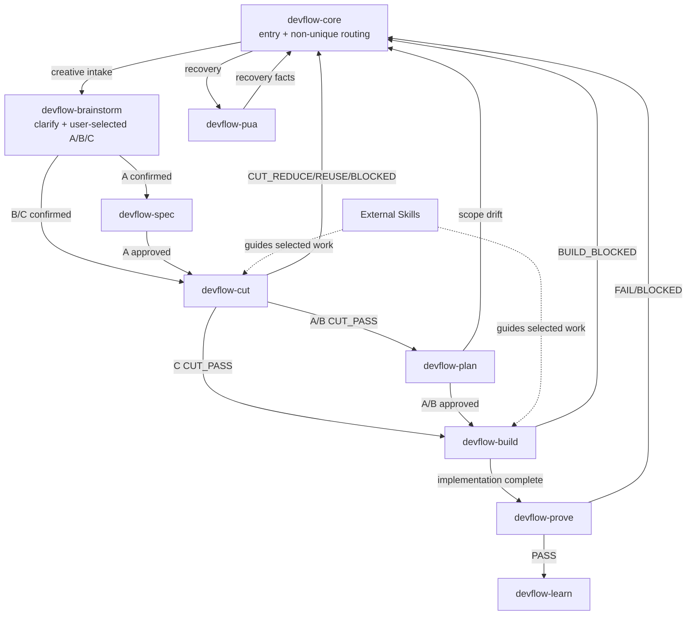

# DevFlow Hybrid Skill Call Diagram



## Runtime Chain

```text
Core handles entry and artifact states without one determined successor.
Brainstorm confirms intent, then the user selects A/B/C.
A: Brainstorm -> Spec -> Cut -> Plan -> Build -> Prove.
B: Brainstorm -> Cut -> Plan -> Build -> Prove.
C: Brainstorm -> Cut -> Build -> Prove.
CUT_REDUCE, CUT_REUSE, CUT_BLOCKED, scope drift, BUILD_BLOCKED,
Proof FAIL/BLOCKED, and PUA recovery return facts to Core.
```

## Short Rules

- Brainstorm preserves Semantic Echo-Back, clarification, and the fixed Confirmed request before it presents A/B/C.
- Users select A/B/C. Brainstorm never infers a depth.
- Spec, Cut, Plan, and Build follow only the direct success edges shown above.
- Core decides every non-unique, blocked, failed, recovery, or changed-intent transition.
- Any completion claim enters Prove. PASS enters Learn; FAIL or BLOCKED returns facts to Core.
- Only after a verified feature implementation with source-behavior or interface-contract change may Learn hand off to `devflow-docs-followup` for an optional documentation inquiry.
- Independent adversarial and find-fault reviews remain outside the lifecycle.
