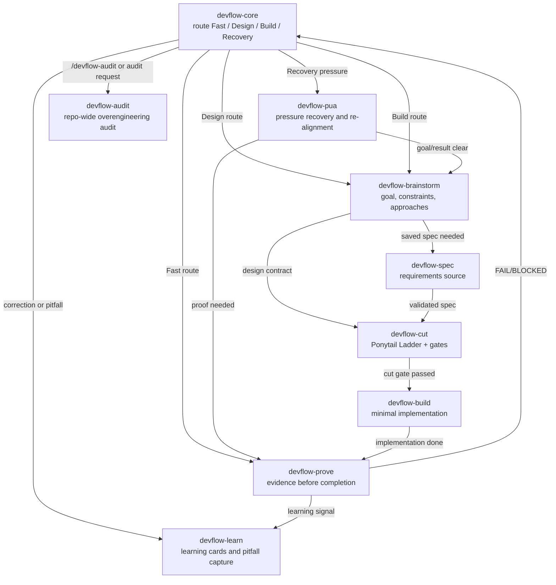

# DevFlow Core Skill Call Diagram



## Runtime Chain

```text
devflow-core -> devflow-brainstorm -> devflow-cut -> devflow-build -> devflow-prove
devflow-core --> devflow-brainstorm
devflow-brainstorm --> devflow-spec
devflow-spec --> devflow-cut
devflow-brainstorm --> devflow-cut
devflow-cut --> devflow-build
devflow-build --> devflow-prove
devflow-core --> devflow-pua
devflow-pua --> devflow-brainstorm
devflow-pua --> devflow-prove
devflow-prove --> devflow-learn
devflow-core --> devflow-audit
```

## Short Rules

- Requirements and behavior changes enter `devflow-brainstorm`.
- Larger or explicitly spec-requested work enters `devflow-spec` before planning.
- New implementation structure enters `devflow-cut`.
- Approved minimal work enters `devflow-build`.
- Any completion claim enters `devflow-prove`.
- User challenge, changed-wrong result, repeated miss, or quality complaint enters `devflow-pua`.
- Corrections and reusable pitfalls enter `devflow-learn`.
- Repo-wide overengineering audits enter `devflow-audit`.
