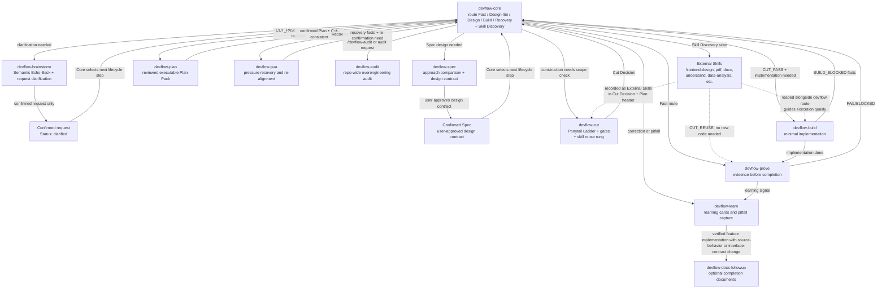

# DevFlow Core Skill Call Diagram



## Runtime Chain

```text
devflow-core -> [Skill Discovery: scan available environment skills]
  -> if external skill matches task: suggest loading it alongside the devflow route
  -> external skills guide execution quality; devflow manages scope and risk
  -> guidance matches travel as External Skills: Cut Decision -> Plan Pack header -> Build loads them
  -> CUT_REUSE only when skill fully handles task with no new code needed
devflow-core -> devflow-brainstorm -> Confirmed request (Status: clarified) -> devflow-core
  -> Core decides whether `devflow-spec` is needed
  -> Spec compares real options -> user-approved design contract / Confirmed Spec -> devflow-core
  -> Core selects devflow-cut, devflow-plan, devflow-build, devflow-prove, or no further lifecycle work
-> devflow-cut [rung 4: does an available skill handle this without new code? -> CUT_REUSE if yes]
  -> Cut Decision -> devflow-core
  -> Core selects: `CUT_PASS` + Plan Pack needed -> devflow-plan -> confirmed Plan + Cut-consistency facts -> devflow-core
  -> Core selects: `CUT_PASS` + implementation needed -> devflow-build
devflow-core -> devflow-pua -> recovery facts + re-confirmation need -> devflow-core
  -> Core may select devflow-brainstorm for clarification only
devflow-prove -> devflow-learn -> devflow-docs-followup (only after a verified feature implementation with a source-behavior or interface-contract change)
devflow-core -> devflow-audit
devflow-core -> external skills (frontend-design, pdf, docx, understand, data-analysis, etc.) loaded alongside the devflow route
```

## Short Rules

- Requirements and behavior changes enter `devflow-brainstorm` only to confirm the request through Semantic Echo-Back, the Understanding Revision Rule, and one-at-a-time clarification.
- Brainstorm outputs `Confirmed request` with `Status: clarified` and returns control to `devflow-core`; it never selects an approach, route, depth, or downstream skill.
- Core decides whether the clarified request needs `devflow-spec`. Spec compares real options, writes and waits for approval of the design contract, then returns the confirmed Spec to Core.
- Core alone decides whether the confirmed request or confirmed Spec needs `devflow-cut`, `devflow-plan`, `devflow-build`, `devflow-prove`, or no further lifecycle work.
- A Plan Pack is created only after `devflow-cut` returns `CUT_PASS` and Core determines that file-level construction planning is needed.
- Any completion claim enters `devflow-prove`.
- Only a verified feature implementation with a source-behavior or interface-contract change loads `devflow-docs-followup`; validation-only, documentation-only, rule-only, skill-only, and no-diff `PASS` results do not prompt for optional follow-up documents.
- User challenge, changed-wrong result, repeated miss, or quality complaint enters `devflow-pua`; it returns recovery facts and any re-confirmation need to Core, which alone may select Brainstorm.
- Corrections and reusable pitfalls enter `devflow-learn`.
- Repo-wide overengineering audits enter `devflow-audit`.
- **External Skill Discovery**: `devflow-core` scans available skills at Sense. External skills complement the route: DevFlow manages scope and risk; external skills guide execution quality. Guidance matches travel down the chain as `External Skills`: recorded in the Cut Decision, inherited by the Plan Pack header, loaded by Build before editing.
- **Build Stop Protocol**: `devflow-build` runs Plan Review before editing; on stale anchors, unclear steps, missing dependencies, or repeated verification failure it returns `BUILD_BLOCKED` facts to Core instead of guessing.
