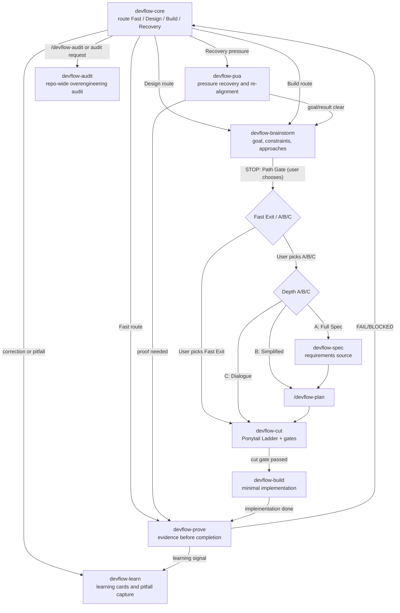

# DevFlow Core Skill Call Diagram



## Runtime Chain

```text
devflow-core -> devflow-brainstorm -> [STOP: Path Gate: user chooses Fast Exit or A/B/C]
  -> Fast Exit (user-chosen): short design contract -> devflow-cut
  -> A/B/C (user-chosen): A: devflow-spec -> /devflow-plan | B: /devflow-plan | C: direct -> devflow-cut
-> devflow-build -> devflow-prove
devflow-core --> devflow-pua
devflow-pua --> devflow-brainstorm
devflow-pua --> devflow-prove
devflow-prove --> devflow-learn
devflow-core --> devflow-audit
```

## Short Rules

- Requirements and behavior changes enter `devflow-brainstorm`, which presents a Path Selection Gate: when Fast Exit conditions are met (small change to existing feature, all boundary gates pass, single plausible path), Fast Exit is offered as a recommended option alongside A/B/C. The user chooses the path — the LLM does not auto-select.
- Depth A saves a spec via `devflow-spec` then plans via `/devflow-plan`; Depth B plans directly; Depth C goes straight to `devflow-cut`.
- New implementation structure enters `devflow-cut`.
- Approved minimal work enters `devflow-build`.
- Any completion claim enters `devflow-prove`.
- User challenge, changed-wrong result, repeated miss, or quality complaint enters `devflow-pua`.
- Corrections and reusable pitfalls enter `devflow-learn`.
- Repo-wide overengineering audits enter `devflow-audit`.
